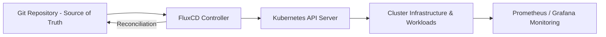

🔥 Let's go. Delivering now.

---

# 🚀 **Production Kubernetes Platform with GitOps Automation**

*A fully automated, enterprise-grade Kubernetes platform engineered for reliability, security, and operational excellence.*

<!-- Tech Badges -->


---

## 🧭 Overview

This repository showcases a **production-ready Kubernetes platform** engineered using **GitOps principles**, **infrastructure as code**, and **enterprise security standards**. It is architected to demonstrate how modern organizations deploy, manage, and scale cloud-native infrastructure using **K3s**, **FluxCD**, **Kustomize**, and a complete observability stack.

> This platform is designed as a **real-world production reference** — capable of supporting internal developer platforms, microservices, and mission-critical workloads using **declarative, secure, and self-healing automation**.

---

## 🎯 Key Platform Capabilities

| Capability                    | Description                                         | Outcome                                  |
| ----------------------------- | --------------------------------------------------- | ---------------------------------------- |
| **GitOps Automation**         | Continuous reconciliation using FluxCD              | Zero-drift, auditable deployments        |
| **Security by Design**        | SOPS encryption, RBAC, TLS, network policies        | Production-grade protection              |
| **Observability Stack**       | Prometheus, Grafana, AlertManager                   | Full visibility into workloads & cluster |
| **Infrastructure as Code**    | Kustomize + Terraform for cluster and app lifecycle | Repeatable and scalable architecture     |
| **Self-Healing Operations**   | Automatic rollback & reconciliation on failure      | 24/7 platform reliability                |
| **Multi-Environment Support** | Staging and Production via declarative overlays     | Safe promotion workflows                 |

---

## 🏗️ Architecture



---

## 🔐 Security & Compliance

* **GitOps-controlled secrets** encrypted using SOPS + Age
* **Zero Trust principles** via NetworkPolicies and TLS
* **RBAC enforcement** across namespaces
* **Non-root containers** and immutable infrastructure
* **Automated dependency updates** using Renovate

---

## 📊 Monitoring & Observability

| Component         | Purpose                        |
| ----------------- | ------------------------------ |
| **Prometheus**    | Metrics & alerting data source |
| **Grafana**       | Visualization and dashboards   |
| **AlertManager**  | Automated notifications        |
| **Node Exporter** | System-level performance data  |

Key dashboards include:

* Cluster health and performance
* Workload metrics
* Storage and network activity
* Alerting & incident response-ready views

---

## ⚙️ GitOps Workflow

```text
1. Developer pushes change to Git
2. FluxCD automatically detects change
3. Flux applies change to cluster
4. Prometheus/Grafana validate cluster state
5. Rollback occurs automatically if reconciliation fails
```

---

## 📁 Repository Structure (Enterprise Format)

```
📦 pi-cluster
├── apps/              # Application workloads
│   ├── base/          # Base kustomizations
│   └── staging/       # Environment-specific overlays
├── clusters/          # Cluster bootstrapping & Flux system
│   └── staging/
├── monitoring/        # Monitoring controllers
├── infrastructure/    # Infra controllers, ingress, storage
└── journal/           # Operational runbooks & documentation
```

---

## 🚀 Deployment

### ✅ Prerequisites

* K3s or compatible Kubernetes cluster
* FluxCD CLI installed
* kubectl access configured

### 🔄 Bootstrap Command

```bash
flux bootstrap github \
  --owner=bmacharia \
  --repository=pi-cluster \
  --branch=main \
  --path=./clusters/staging
```

---

## 📌 Resume & LinkedIn Achievement Bullets

**Use these directly in your resume & LinkedIn projects section:**

* Engineered a **production-grade Kubernetes platform** using **GitOps automation (FluxCD)**, enabling **continuous reconciliation and zero-drift deployments** across environments.
* Implemented **enterprise security controls**, including **SOPS-encrypted secrets, RBAC, TLS termination, and network policies**, ensuring compliance and workload isolation.
* Deployed a complete **observability stack (Prometheus, Grafana, AlertManager)** providing actionable insights and real-time reliability monitoring.
* Automated platform operations with **Renovate and Kustomize**, enabling **safe rollouts, auto-dependency upgrades**, and **self-healing infrastructure**.

> **LinkedIn Title Suggestion:** *Production Kubernetes Platform with GitOps, Observability & Enterprise Security*

---

## 📫 Contact

**Maintainer:** Babu Macharia
🔗 LinkedIn: [https://linkedin.com/in/babu-macharia](https://linkedin.com/in/babu-macharia)
🌐 Blog: [https://babumacharia.com](https://babumacharia.com)

---

### ⭐ *If this project demonstrates the future of platform automation, consider starring the repository!*

📌 *This platform reflects real-world production standards used by enterprises adopting Kubernetes and GitOps.*

---

